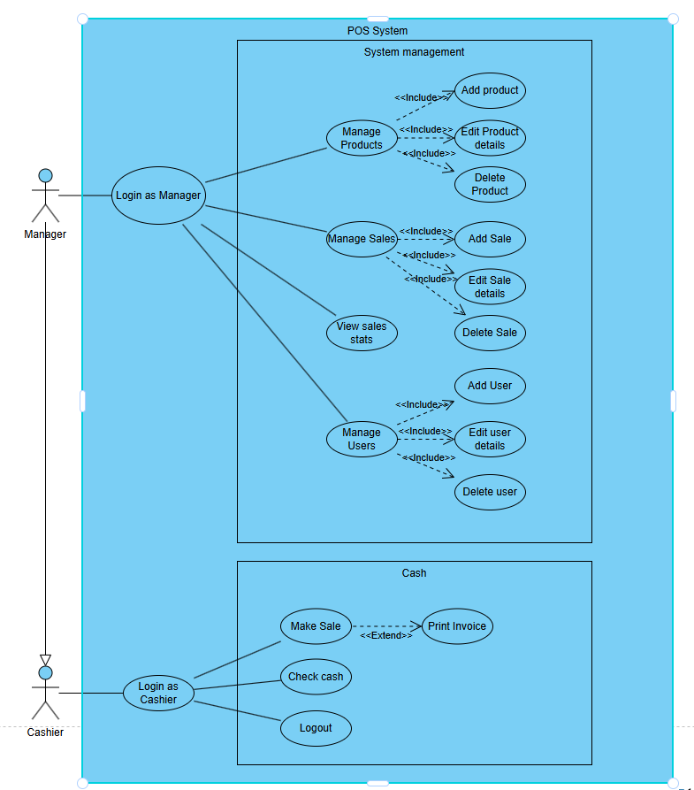
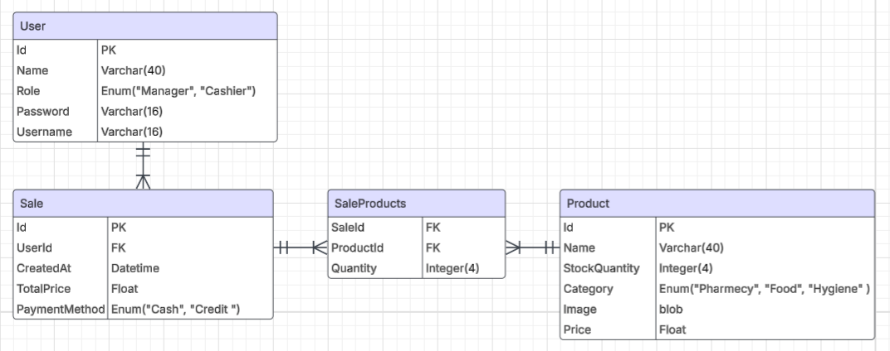
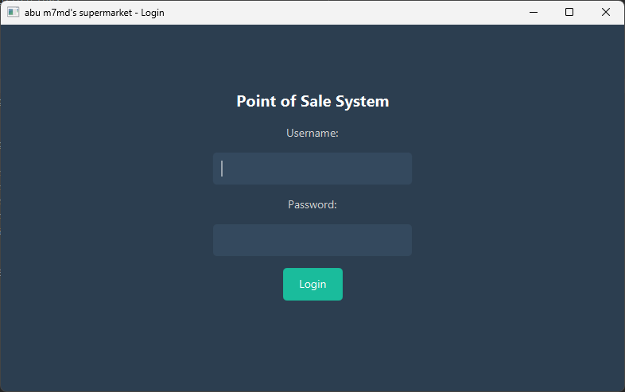
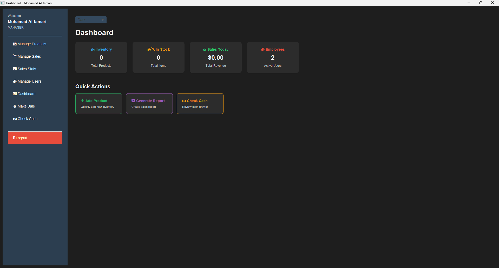
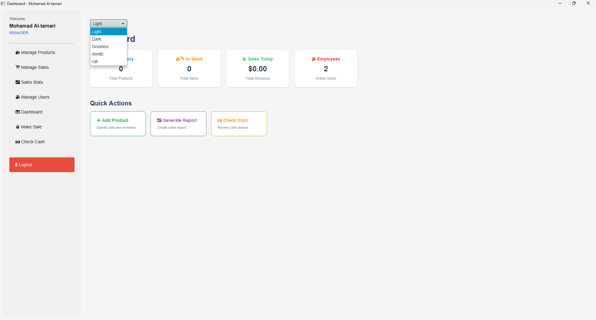
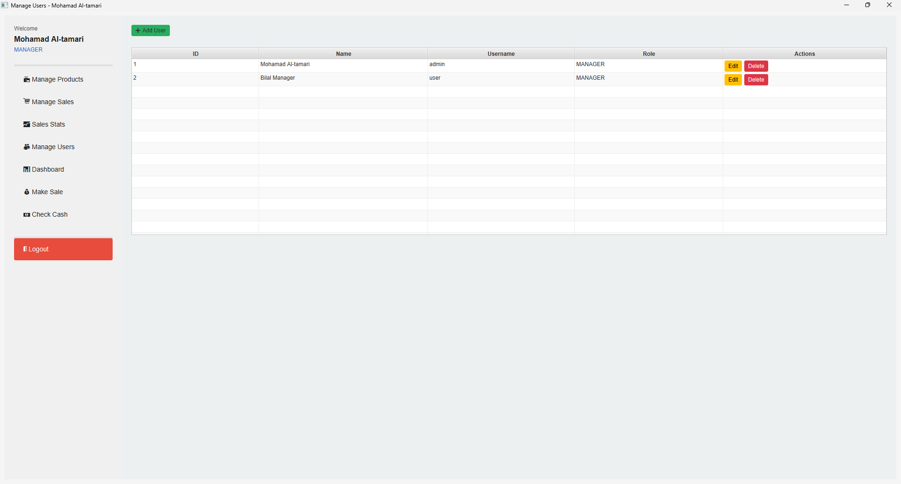

# 🧾 SimplePointOfSale

A lightweight JavaFX-based Point of Sale system connected to a MySQL database. Built for managing product sales, users, and analytics through a clean, modular interface.

> ✅ Developed as a final project for the **Object Oriented Programming 2** course at **Applied Science University, Jordan**.  
> 🧑‍🏫 Supervised by **Dr. Radwan Batieha**.

## 🔧 Features

- 👤 **User Authentication** – Login system with roles.
- 🛍️ **Product Management** – Add, update, and delete products.
- 💸 **Sales Management** – Record and delete sales transactions.
- 📊 **Statistics Dashboard** – View sales statistics per user/date.
- 🎨 **Theme Switcher** – Supports multiple CSS themes (e.g. Dark, Nordic, Gruvbox).
- 📤 **Export to CSV** – Export tables to CSV files.
- 🧩 **Modular MVC Architecture**

---

## 🧪 Technologies Used

- **JavaFX** – UI framework.
- **MySQL** – Relational database.
- **JDBC** – Database connection.
- **CSS** – Custom themes.
- **NetBeans** – Development environment.

---

## 📊 Diagrams

### 🧩 Use Case Diagram

The Use Case Diagram outlines the main user interactions with the system, including both cashier and manager roles.



> 📌 **Actors:**  
> - Cashier: Performs sales and checks cash.  
> - Manager: Manages users, products, and views sales/statistics.
---

### 🗃️ ER (Entity-Relationship) Diagram

The ER Diagram showcases the relationships between key entities in the system such as `User`, `Sale`, and `Product`.



> 📌 **Entities & Relationships:**  
> - Each `Sale` is linked to a single `User`.  
> - Each `Sale` may consist of multiple `Product` entries.  
> - `User` has `Role` (Cashier or Manager).

---

## 👥 Contributors

<table>
  <tr>
    <td align="center">
      <a href="https://github.com/dotacow">
        <br />
        <sub><b>Yousef Kitaneh</b></sub>
      </a><br />
      👨‍💻 Developer
    </td>
    <td align="center">
      <a href="https://github.com/hamza10755">
        <br />
        <sub><b>Hamza Tarek</b></sub>
      </a><br />
      👨‍💻 Developer
    </td>
    <td align="center">
      <a href="https://github.com/YousefKurchaloy">
        <br />
        <sub><b>Yousef Alshishani</b></sub>
      </a><br />
      👨‍💻 Developer
    </td>
  </tr>
</table>

---

## 📸 Screenshots

### 🔐 Login Screen


### 📊 Dashboard



### 🧑🏻 Manage Users


---

## 📁 Project Structure

```bash
src/
├── controllers/
│   ├── DashboardController.java
│   ├── ProductController.java
│   ├── SaleController.java
│   ├── StatisticsController.java
│   └── UserController.java
│
├── main/
│   └── Main.java
│
├── models/
│   ├── Product.java
│   ├── Sale.java
│   └── User.java
│
├── themes/
│   ├── base.css
│   ├── cat.css
│   ├── dark.css
│   ├── gruvbox.css
│   ├── light.css
│   └── nordic.css
│
├── utils/
│   ├── CSVExporter.java
│   ├── DBHelper.java
│   ├── ResHelper.java
│   └── ThemeManager.java
│
├── views/
│   ├── cashierScenes/
│   │   ├── CheckCashScene.java
│   │   └── MakeSaleScene.java
│   │
│   ├── globalScenes/
│   │   ├── DashBoardScene.java
│   │   ├── LoginView.java
│   │   └── SideBarComponent.java
│   │
│   └── managersScenes/
│       ├── ManageProductsScene.java
│       ├── ManageSalesScene.java
│       ├── ManageUsersScene.java
│       └── ViewSalesStatsScene.java
